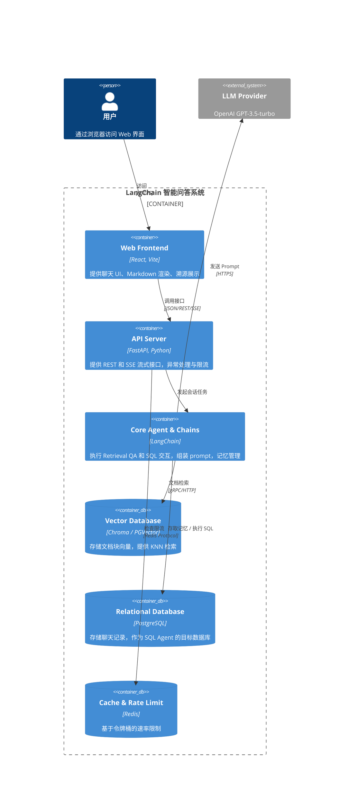
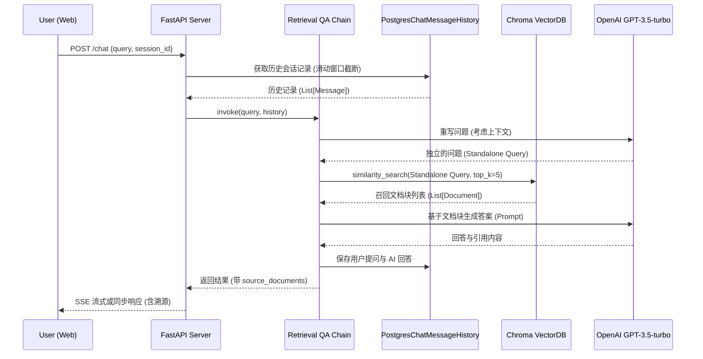

# 技术选型与架构

## 1. 技术选型
- **编程语言**：Python 3.11 + Poetry (依赖锁定)
- **框架**：LangChain >= 0.1.0, FastAPI
- **向量数据库**：Chroma (本地) / PGVector (生产)
- **关系数据库**：PostgreSQL 14+
- **模型**：OpenAI GPT-3.5-turbo (文本生成), text-embedding-ada-002 (嵌入)
- **前端**：React + Vite + TailwindCSS
- **中间件**：Redis (速率限制)
- **测试与部署**：Pytest, Locust, Docker, GitHub Actions, Prometheus, Grafana

## 2. 架构分层设计
```text
[Web Frontend] (React SPA, Vite)
       |
       v
[API Layer] (FastAPI: /ask, /chat, /health)
       |
       v
[Service Layer] (业务编排，异常处理，请求路由)
       |
       +--> [Agent Layer] (Structured SQL Agent, 工具调用)
       |
       +--> [Chain Layer] (Retrieval QA Chain, 流程组合)
       |
       v
[Memory & Retrieval] (PostgresChatMessageHistory, Chroma/PGVector)
```

## 3. C4 模型 (Context & Container)

### 3.1 容器图


### 3.2 序列图 (Retrieval QA)

